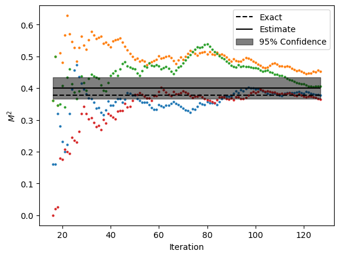

.. _cluster:

Exact Boltzmann Weights - Cluster Update
****************************************

This example shows how to run the time-seriers QMC algorithm for  transverse filed Ising model on 10-sites
honeycomb lattice with open boundaries using cluster update with exact Boltzmann weights.

Script
======

:download:`download script <../../examples/exact_boltzmann_cluster.py>`

.. literalinclude:: ../../examples/exact_boltzmann_cluster.py
   :language: python

Output
======
**Note:** Your output might be different due to the stastical nature of the algorithm.

