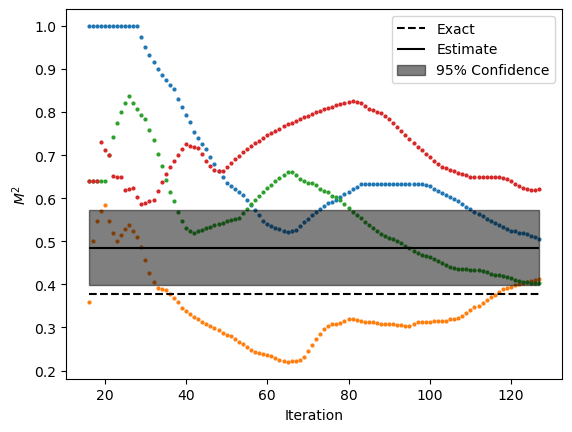

Exact Boltzmann Weights - Single Spin Flip
*******************************************

This example shows how to run the time-seriers QMC algorithm for  transverse filed Ising model on 10-sites
honeycomb lattice with open boundaries using single flip update with exact Boltzmann weights.

.. note::
   The number of samples were intentionally set to a small value to illustrate the difference with
   :ref:`the cluster update <cluster>`.
   Better results (i.e. lower variance) can be obtained by increasing the number of samples. 

Script
======

:download:`download script <../../examples/exact_boltzmann_singleflip.py>`

.. literalinclude:: ../../examples/exact_boltzmann_singleflip.py
   :language: python

Output
======
**Note:** Your output might be different due to the stastical nature of the algorithm.

