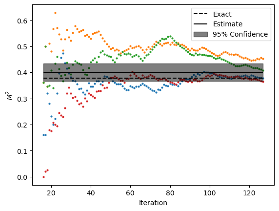

.. _nnls:

Exact Loschmidt Echos - NNLS
****************************************

This example shows how to run the time-seriers QMC algorithm for  transverse filed Ising model on 10-sites
honeycomb lattice with open boundaries using cluster update with Boltzmann weights estimated from exact Loschmidt
echos with non-negative least squares method.

Script
======

:download:`download script <../../examples/exact_loschmidt_nnls.py>`

.. literalinclude:: ../../examples/exact_loschmidt_nnls.py
   :language: python

Output
======
**Note:** Your output might be different due to the stastical nature of the algorithm.

