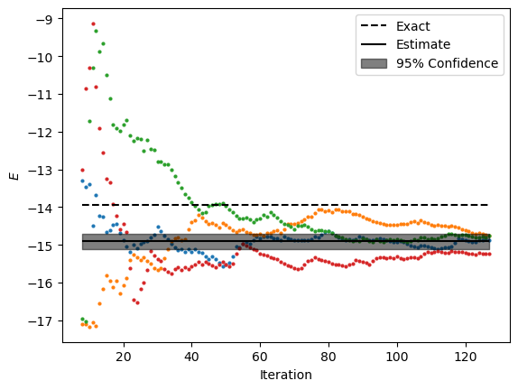

QC Loschmidt Echos - Cat State
*******************************

This example shows how to estimate the energy of Heisenberg model on 12-sites kagome lattice with periodic boundaries 
using cluster update with Boltzmann weights estimated from noisy Loschmidt echos with non-negative least squares method. 
The Loschmidt echos are estimated via cat state quantum circuits.

Script
======

:download:`download script <../../examples/qc_loschmidt_catstate.py>`

.. literalinclude:: ../../examples/qc_loschmidt_catstate.py
   :language: python

Output
======
**Note:** Your output might be different due to the stastical nature of the algorithm.

